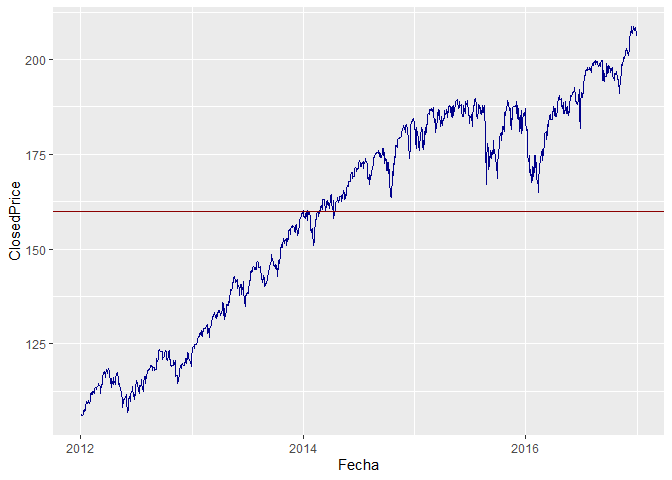
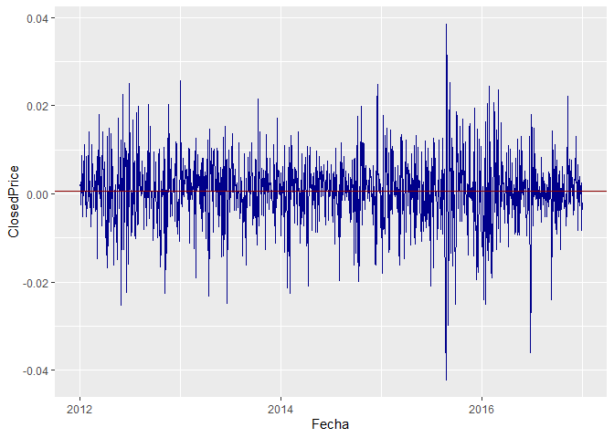
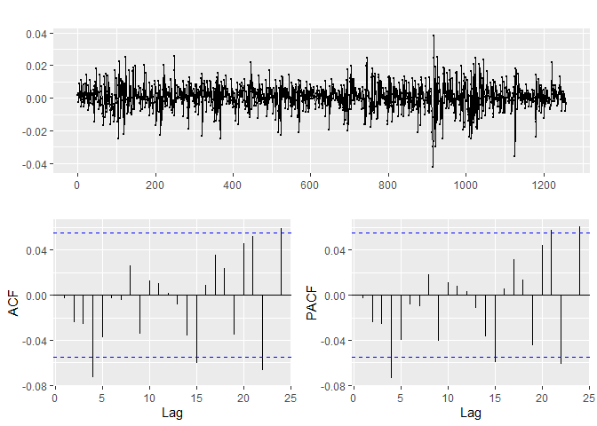
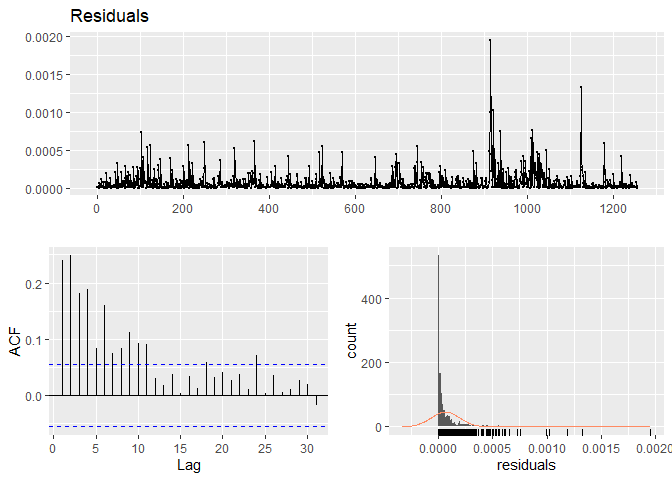

Trabajo Final Bautista - R Finanzas Avanzado
================
Ricardo Bautista

# Modelando series de tiempo - S&P 500

En esta ocasión se modelará el índice Standard & Poor’s 500 conocido por
ser uno de los índices más importantes de los Estados Unidos. Para
realizar esto se trabajará con las herramaienteas de series de tiempo
que nos ofrece R. Modelar este tipo de índices o el análisis univariado,
en general, es de utilidad al momento de querer realizar predicciones a
futuro o analizar como se ha comportado la serie debido a ciertos
eventos o la propia caracterización de la variable. Normalmente, este
análisis es muy utilizado en el área de finanzas porque el inversionista
está interesado en estimar la tasa de retorno y su volatilidad en un
periodo de tenencia. Así, los modelos GARCH suponen una estimación
simultánea de la media y la varianza condicionales. Por otra parte,
existen los modelos que incorporan los “efectos asimétricos” como el
EGARCH que denotan que noticias negativas pueden afectar en mayor
magnitud a la volatilidad de la variable.

## Importación de datos y Gráficos

Primero, cargamos librerías y limpiamos variables

``` r
rm(list = ls())
library(data.table)
library(ggplot2)
library(stringr)
library(quantmod)
library(PerformanceAnalytics)
library(urca)
library(forecast)
library(rugarch)
```

Importamos los datos por medio de *cuantmod* y los guardamos en
dt\_accion\_SPY. Se trabajará en el periodo del 2012-01-01 hasta el
2016-12-31

``` r
dt_accion_SPY <- data.table(Ad(getSymbols(Symbols = "SPY",
                                      from = "2012-01-01",
                                      to = "2016-12-31",
                                      src = "yahoo",
                                      auto.assign = FALSE)),keep.rownames = T)

colnames(dt_accion_SPY) <- c("Fecha","ClosedPrice")
```

<div data-pagedtable="false">

<script data-pagedtable-source type="application/json">
{"columns":[{"label":["Fecha"],"name":[1],"type":["date"],"align":["right"]},{"label":["ClosedPrice"],"name":[2],"type":["dbl"],"align":["right"]}],"data":[{"1":"2012-01-03","2":"105.9852"},{"1":"2012-01-04","2":"106.1514"},{"1":"2012-01-05","2":"106.4341"},{"1":"2012-01-06","2":"106.1598"},{"1":"2012-01-09","2":"106.4174"},{"1":"2012-01-10","2":"107.3402"}],"options":{"columns":{"min":{},"max":[10]},"rows":{"min":[10],"max":[10]},"pages":{}}}
  </script>

</div>

Creamos los retornos de la acción

``` r
dt_retorno_SPY <- data.table(Return.calculate(dt_accion_SPY),keep.rownames = T)
dt_retorno_SPY <- na.omit(dt_retorno_SPY)
colnames(dt_retorno_SPY) <- c("Fecha","ClosedPrice")
```

Creamos los gráficos de líneas para un análisis visual
<!-- --><!-- -->

Los closed prices de la serie normal presentan una tendencia estacional
creciente (no estacionario en media) y no en varianza. Mientras que la
serie en retornos presenta estacionalidad en media.

## Tests estadísticos de Raíz unitaria y correlograma

Primero se procederá a realizar un test de raíz unitaria de dickey
fuller aumentado. *Para la acción*

``` r
dfa.accion_SPY <- ur.df(dt_accion_SPY$ClosedPrice,lags = 10)
  summary(dfa.accion_SPY)
```

    ## 
    ## ############################################### 
    ## # Augmented Dickey-Fuller Test Unit Root Test # 
    ## ############################################### 
    ## 
    ## Test regression none 
    ## 
    ## 
    ## Call:
    ## lm(formula = z.diff ~ z.lag.1 - 1 + z.diff.lag)
    ## 
    ## Residuals:
    ##     Min      1Q  Median      3Q     Max 
    ## -7.7894 -0.6028  0.0228  0.7501  5.6428 
    ## 
    ## Coefficients:
    ##                Estimate Std. Error t value Pr(>|t|)  
    ## z.lag.1       0.0005425  0.0002333   2.325   0.0202 *
    ## z.diff.lag1  -0.0078723  0.0284570  -0.277   0.7821  
    ## z.diff.lag2  -0.0262800  0.0284181  -0.925   0.3553  
    ## z.diff.lag3  -0.0256443  0.0284471  -0.901   0.3675  
    ## z.diff.lag4  -0.0678284  0.0284551  -2.384   0.0173 *
    ## z.diff.lag5  -0.0359373  0.0285197  -1.260   0.2079  
    ## z.diff.lag6  -0.0065387  0.0285164  -0.229   0.8187  
    ## z.diff.lag7  -0.0108772  0.0284533  -0.382   0.7023  
    ## z.diff.lag8   0.0135861  0.0284472   0.478   0.6330  
    ## z.diff.lag9  -0.0515269  0.0284398  -1.812   0.0703 .
    ## z.diff.lag10 -0.0034495  0.0284787  -0.121   0.9036  
    ## ---
    ## Signif. codes:  0 '***' 0.001 '**' 0.01 '*' 0.05 '.' 0.1 ' ' 1
    ## 
    ## Residual standard error: 1.31 on 1236 degrees of freedom
    ## Multiple R-squared:  0.01233,    Adjusted R-squared:  0.003537 
    ## F-statistic: 1.402 on 11 and 1236 DF,  p-value: 0.1655
    ## 
    ## 
    ## Value of test-statistic is: 2.3254 
    ## 
    ## Critical values for test statistics: 
    ##       1pct  5pct 10pct
    ## tau1 -2.58 -1.95 -1.62

En el caso de la acción se ve que el t calculado (2.3254 ) es menor al t
crítico (-1.95). Por lo tanto, con 95% de confianza hay raíz unitaria y
no es estacionario. \*Para los retornos

``` r
dfa.retorno_SPY <- ur.df(dt_retorno_SPY$ClosedPrice,lags = 10)
  summary(dfa.retorno_SPY)
```

    ## 
    ## ############################################### 
    ## # Augmented Dickey-Fuller Test Unit Root Test # 
    ## ############################################### 
    ## 
    ## Test regression none 
    ## 
    ## 
    ## Call:
    ## lm(formula = z.diff ~ z.lag.1 - 1 + z.diff.lag)
    ## 
    ## Residuals:
    ##       Min        1Q    Median        3Q       Max 
    ## -0.043321 -0.003390  0.000667  0.005205  0.035103 
    ## 
    ## Coefficients:
    ##               Estimate Std. Error t value Pr(>|t|)    
    ## z.lag.1      -1.130868   0.103274 -10.950   <2e-16 ***
    ## z.diff.lag1   0.128392   0.098082   1.309    0.191    
    ## z.diff.lag2   0.106997   0.092446   1.157    0.247    
    ## z.diff.lag3   0.086193   0.086795   0.993    0.321    
    ## z.diff.lag4   0.017383   0.080421   0.216    0.829    
    ## z.diff.lag5  -0.019527   0.073505  -0.266    0.791    
    ## z.diff.lag6  -0.020343   0.065871  -0.309    0.757    
    ## z.diff.lag7  -0.023220   0.057799  -0.402    0.688    
    ## z.diff.lag8   0.001904   0.049612   0.038    0.969    
    ## z.diff.lag9  -0.032615   0.040204  -0.811    0.417    
    ## z.diff.lag10 -0.014997   0.028423  -0.528    0.598    
    ## ---
    ## Signif. codes:  0 '***' 0.001 '**' 0.01 '*' 0.05 '.' 0.1 ' ' 1
    ## 
    ## Residual standard error: 0.008089 on 1235 degrees of freedom
    ## Multiple R-squared:  0.5044, Adjusted R-squared:  0.4999 
    ## F-statistic: 114.2 on 11 and 1235 DF,  p-value: < 2.2e-16
    ## 
    ## 
    ## Value of test-statistic is: -10.9501 
    ## 
    ## Critical values for test statistics: 
    ##       1pct  5pct 10pct
    ## tau1 -2.58 -1.95 -1.62

En el caso de los retornos se ve que el t calculado (-10.9501) es mayor
al t crítico (-1.95). Por lo tanto, con 95% de confianza no hay raíz
unitaria y es estacionario.

Viendo el correlograma de los retornos
<!-- -->

Mediante el análisis gráfico la autocovariancia muestra significancia en
el 4to rezago (sugiriendo un MA4) y la autocorrleación parcial muestra
significancia en el 4to rezago (sugiriendo un AR4). El análisis gráfico
sugiere un ARMA(4,4), por lo que mediante el comando *autoarima* se
determinará el mejor modelo mediante el criterio AICC AIC BIC (el
menor).

``` r
modelo1 <- auto.arima(dt_retorno_SPY$ClosedPrice,
                     max.p = 5,
                     max.q = 5,
                     stationary = TRUE,
                     ic = c("aicc", "aic", "bic"),
                     trace = TRUE)
```

    ## 
    ##  Fitting models using approximations to speed things up...
    ## 
    ##  ARIMA(2,0,2) with non-zero mean : -8552.46
    ##  ARIMA(0,0,0) with non-zero mean : -8551.518
    ##  ARIMA(1,0,0) with non-zero mean : -8548.536
    ##  ARIMA(0,0,1) with non-zero mean : -8549.522
    ##  ARIMA(0,0,0) with zero mean     : -8547.431
    ##  ARIMA(1,0,2) with non-zero mean : -8554.9
    ##  ARIMA(0,0,2) with non-zero mean : -8548.398
    ##  ARIMA(1,0,1) with non-zero mean : Inf
    ##  ARIMA(1,0,3) with non-zero mean : -8552.902
    ##  ARIMA(0,0,3) with non-zero mean : -8547.436
    ##  ARIMA(2,0,1) with non-zero mean : -8554.579
    ##  ARIMA(2,0,3) with non-zero mean : -8550.501
    ##  ARIMA(1,0,2) with zero mean     : -8544.867
    ## 
    ##  Now re-fitting the best model(s) without approximations...
    ## 
    ##  ARIMA(1,0,2) with non-zero mean : -8554.793
    ## 
    ##  Best model: ARIMA(1,0,2) with non-zero mean

``` r
summary(modelo1)
```

    ## Series: dt_retorno_SPY$ClosedPrice 
    ## ARIMA(1,0,2) with non-zero mean 
    ## 
    ## Coefficients:
    ##          ar1      ma1      ma2   mean
    ##       0.9452  -0.9556  -0.0182  5e-04
    ## s.e.  0.0213   0.0353   0.0295  1e-04
    ## 
    ## sigma^2 estimated as 6.452e-05:  log likelihood=4282.42
    ## AIC=-8554.84   AICc=-8554.79   BIC=-8529.16
    ## 
    ## Training set error measures:
    ##                        ME        RMSE         MAE MPE MAPE      MASE
    ## Training set 1.983126e-05 0.008019702 0.005860734 NaN  Inf 0.6768568
    ##                       ACF1
    ## Training set -8.461287e-05

El mejor modelo es un ARIMA(1,0,2) o ARMA(1,2) con los menores AIC, BIC
y AICc.

## Modelación de varianza

El primer paso es comprobar que efectivamente los residuos del modelo
calculado anteriormente siguen el comportamiento de un ruido blanco.
Mediante *checkresiduals* podemos notar si se comporta así.

``` r
rescuad <- residuals(modelo1)^2
checkresiduals(rescuad)
```

<!-- -->

Se puede ver que algunos rezagos son significativos, no es un ruido
blanco. Asimismo, la distribución no se asemeja a una normal.

De la misma manera se realiza un test Ljung-Box para probar
independencia de datos

``` r
Box.test(rescuad, type="Ljung-Box")
```

    ## 
    ##  Box-Ljung test
    ## 
    ## data:  rescuad
    ## X-squared = 72.117, df = 1, p-value < 2.2e-16

Como el p valor es menor a 0.05 se rechaza la hipótesis nula con 95% de
confianza y no hay suficiente evidencia estadística para probar que los
datos se distribuyen independientemente.

Para modelar la varianza se utilizará el EGARCH que permite modelar los
choques asimétricos propios de una acción (los choques buenos no afectan
de la misma forma que los malos), asimismo nos permite notar un efecto
leverage dependiendo del signo del coeficiente gamma.

``` r
model.spec <- ugarchspec(variance.model = list(model = "eGARCH",garchOrder= c(1,1)),
                         mean.model = list(armaOrder = c(1,2),include.mean = TRUE),
                         distribution.model = "norm")
egarch11_SPY <- ugarchfit(spec = model.spec,
                            data = dt_retorno_SPY$ClosedPrice,
                            solver = "solnp")
egarch11_SPY
```

    ## 
    ## *---------------------------------*
    ## *          GARCH Model Fit        *
    ## *---------------------------------*
    ## 
    ## Conditional Variance Dynamics    
    ## -----------------------------------
    ## GARCH Model  : eGARCH(1,1)
    ## Mean Model   : ARFIMA(1,0,2)
    ## Distribution : norm 
    ## 
    ## Optimal Parameters
    ## ------------------------------------
    ##         Estimate  Std. Error    t value Pr(>|t|)
    ## mu      0.000753    0.000000   4193.305        0
    ## ar1     0.996210    0.000070  14292.362        0
    ## ma1    -1.035032    0.000019 -55549.901        0
    ## ma2     0.030974    0.000000  75076.972        0
    ## omega  -0.833552    0.002995   -278.288        0
    ## alpha1 -0.298197    0.003350    -89.024        0
    ## beta1   0.915065    0.000192   4761.064        0
    ## gamma1  0.055819    0.000505    110.497        0
    ## 
    ## Robust Standard Errors:
    ##         Estimate  Std. Error    t value Pr(>|t|)
    ## mu      0.000753    0.000001    987.932        0
    ## ar1     0.996210    0.000108   9267.023        0
    ## ma1    -1.035032    0.000042 -24729.764        0
    ## ma2     0.030974    0.000004   6906.521        0
    ## omega  -0.833552    0.009347    -89.180        0
    ## alpha1 -0.298197    0.011821    -25.226        0
    ## beta1   0.915065    0.001044    876.895        0
    ## gamma1  0.055819    0.001702     32.800        0
    ## 
    ## LogLikelihood : 4431.095 
    ## 
    ## Information Criteria
    ## ------------------------------------
    ##                     
    ## Akaike       -7.0375
    ## Bayes        -7.0049
    ## Shibata      -7.0376
    ## Hannan-Quinn -7.0253
    ## 
    ## Weighted Ljung-Box Test on Standardized Residuals
    ## ------------------------------------
    ##                          statistic p-value
    ## Lag[1]                    0.001096  0.9736
    ## Lag[2*(p+q)+(p+q)-1][8]   3.667201  0.9205
    ## Lag[4*(p+q)+(p+q)-1][14]  6.468966  0.6644
    ## d.o.f=3
    ## H0 : No serial correlation
    ## 
    ## Weighted Ljung-Box Test on Standardized Squared Residuals
    ## ------------------------------------
    ##                         statistic p-value
    ## Lag[1]                    0.06348  0.8011
    ## Lag[2*(p+q)+(p+q)-1][5]   0.28712  0.9850
    ## Lag[4*(p+q)+(p+q)-1][9]   1.30180  0.9702
    ## d.o.f=2
    ## 
    ## Weighted ARCH LM Tests
    ## ------------------------------------
    ##             Statistic Shape Scale P-Value
    ## ARCH Lag[3]    0.1431 0.500 2.000  0.7052
    ## ARCH Lag[5]    0.4276 1.440 1.667  0.9048
    ## ARCH Lag[7]    1.2885 2.315 1.543  0.8626
    ## 
    ## Nyblom stability test
    ## ------------------------------------
    ## Joint Statistic:  1.2302
    ## Individual Statistics:              
    ## mu     0.06103
    ## ar1    0.08932
    ## ma1    0.06072
    ## ma2    0.06058
    ## omega  0.12071
    ## alpha1 0.12457
    ## beta1  0.11652
    ## gamma1 0.04978
    ## 
    ## Asymptotic Critical Values (10% 5% 1%)
    ## Joint Statistic:          1.89 2.11 2.59
    ## Individual Statistic:     0.35 0.47 0.75
    ## 
    ## Sign Bias Test
    ## ------------------------------------
    ##                    t-value    prob sig
    ## Sign Bias            1.775 0.07609   *
    ## Negative Sign Bias   1.271 0.20390    
    ## Positive Sign Bias   1.274 0.20297    
    ## Joint Effect         3.697 0.29605    
    ## 
    ## 
    ## Adjusted Pearson Goodness-of-Fit Test:
    ## ------------------------------------
    ##   group statistic p-value(g-1)
    ## 1    20     55.54    1.922e-05
    ## 2    30     71.33    1.990e-05
    ## 3    40     85.28    2.667e-05
    ## 4    50     99.76    2.523e-05
    ## 
    ## 
    ## Elapsed time : 0.8168139

En este caso se ve que el coeficiente Gamma1 (0.055819) es positivo y
significativo, lo que indica que no hay efecto *Leverage* para el S&P
500.

También se reportan los criterios Akaike, Bayes, Shibata y Hannan-Quinn

``` r
dt_egarch11_SPY <- data.table(infocriteria(egarch11_SPY),keep.rownames = T)
dt_egarch11_SPY
```

<div data-pagedtable="false">

<script data-pagedtable-source type="application/json">
{"columns":[{"label":["rn"],"name":[1],"type":["chr"],"align":["left"]},{"label":["V1"],"name":[2],"type":["dbl"],"align":["right"]}],"data":[{"1":"Akaike","2":"-7.037542"},{"1":"Bayes","2":"-7.004852"},{"1":"Shibata","2":"-7.037622"},{"1":"Hannan-Quinn","2":"-7.025256"}],"options":{"columns":{"min":{},"max":[10]},"rows":{"min":[10],"max":[10]},"pages":{}}}
  </script>

</div>

Tras el proceso, se puede apreciar que se estimó un ARMA(1,2) por parte
de los retornos de la acción (transformación que eliminó la raíz
unitaria de los precios de cierre). Asimismo, se modeló la varianza
condicional a través de un EGARCH, el cual contiene un componente que
describe el logaritmo de la varianza condicional. En este caso el
proceso no mostró efecto *leverage* o apalancamiento (mayor volatilidad
ante shocks negativos que ante shocks positivos).
