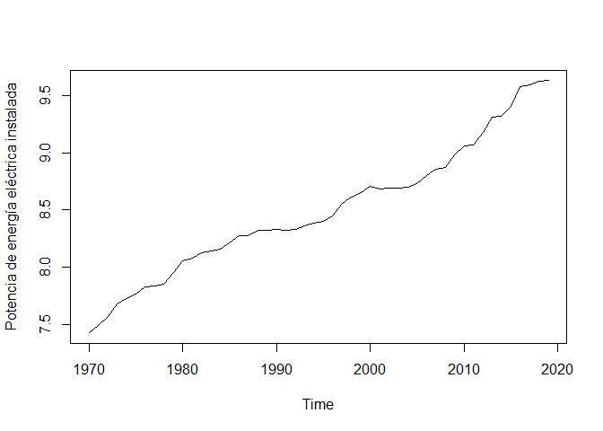

La electricidad como fuente de energía del PIB. Un análisis VAR para los
periodos 1973 al 2019 en el Perú.
================
Ricardo Bautista

## Introducción

La búsqueda sobre los determinantes del Producto interno bruto (PIB) ha
sido de gran importancia desde los inicios de la literatura económica.
Se sabe desde la perspectiva clásica que se ve, principalmente,
influenciado por componentes como el consumo, ingreso, inversiones y
exportaciones netas. No obstante, con la sofisticación de las economías
y de la tecnología, la práctica sugiere buscar nuevas formas de explicar
que factores mueven al PIB de un país a lo largo del tiempo para, de
alguna manera, facilitar la intervención de los hacedores de política o
entender los nuevos mecanismos del mercado.

Con el crecimiento de la tecnología y su alta relación con los factores
productivos, se puede apreciar que uno de los componentes principales es
la electricidad. Stern, Burke & Bruns (2019) en su paper hablan de una
correlación significativa de la electricidad con el desarrollo
económico, haciendo alusión a que las fuentes de energía eléctrica son
de suma importancia para un positivo desarrollo en una economía.
Siguiendo, así, parte de la idea planteada por los autores, en el
presente trabajo se hará una estimación por medio de un modelo VAR con
las variables: PIB (en valores a precios constantes de 2007) y la
Potencia de energía eléctrica instalada en el Perú durante el periodo de
1973 al 2019.

Empezando con los datos, ambas variables fueron obtenidas de las
estadísticas de la central de datos del Banco Central de Reserva del
Perú. Luego fueron aplicados logaritmos en ambas variables a fin de
estabilizar las variables y reducir sensibilidades en las mismas. Cabe
resaltar que la potencia instalada en la industria eléctrica es la
sumatoria de las capacidades reales de generación de cada central
eléctrica (Osinergmin, 2016).

Para la metodología a utilizar, Vectores autorregresivos o VAR, se basa
en estimar por Mínimos cuadrados ordinarios k ecuaciones (igual al
número de variables dependientes) donde las variables a explicar
dependerán de sus rezagos (tal como el caso de un proceso AR), pero con
la inclusión de rezagos de otras variables que se consideren importantes
en cuanto a su estimación.

<div align="center">

Yt=β10+β¬11Yt−1+⋯+β1pYt−p+γ11Xt−1+⋯+γ1pXt−p+u1t,

Xt=β20+β21Yt−1+⋯+β2pYt−p+γ21Xt−1+⋯+γ2pXt−p+u2t.

</div>

Los estimadores hallados por MCO son considerados consistentes y con
tendencia conjunta normal en muestras grandes por lo que se pueden usar
metodologías como la prueba t para significancia. Asimismo, a diferencia
de una estimación convencional, esta nos permite inferir casualidad por
medio de la variable explicativa y de la explicada utilizando partes de
sus rezagos, importante para el análisis que se va a realizar. Por otra
parte, gracias a su forma AR, se pueden realizar gráficos de impulso
respuesta que son de utilidad para ver como una variable se comportaría
en cuanto a un shock exógeno en la otra. En el presente trabajo se optó
por un VAR (3) de tal manera que el modelo resulta en

<div align="center">

Yt=β10+β11Yt−1+β12Yt−2+ β13Yt−3+γ11Xt−1+γ12Xt−2+ γ13Xt−3+u1t,

Xt=β20+β21Yt−1+β22Yt−2+ β23Yt−3+γ21Xt−1+γ22Xt-2+ γ23Xt−3−2+u2t.

</div>

Donde Yt correspondería al PIB y xt a la Potencia de energía eléctrica
instalada.

<!-- --><!-- -->

## Desarrollo

### Test ADF de raíz unitaria

Para la serie de PIB se realizó una diferencia para eliminar la raíz
unitaria; mientras que, para la serie de electricidad se diferenció tres
veces. A continuación se muestran los gráficos y los resultados de los
tests después de las diferencias.

``` r
plot.ts(PBI_series)
```

<!-- -->

``` r
adf_PBI <- adf.test(PBI_series)
```

    ## Warning in adf.test(PBI_series): p-value smaller than printed p-value

``` r
adf_PBI
```

    ## 
    ##  Augmented Dickey-Fuller Test
    ## 
    ## data:  PBI_series
    ## Dickey-Fuller = -4.4113, Lag order = 3, p-value = 0.01
    ## alternative hypothesis: stationary

``` r
#p-value = 0.01 - Una diferencia para estacionalizar la serie

plot.ts(Electricidad_series)
```

<!-- -->

``` r
adf_Elec <- adf.test(Electricidad_series)
```

    ## Warning in adf.test(Electricidad_series): p-value smaller than printed p-value

``` r
adf_Elec
```

    ## 
    ##  Augmented Dickey-Fuller Test
    ## 
    ## data:  Electricidad_series
    ## Dickey-Fuller = -4.2355, Lag order = 3, p-value = 0.01
    ## alternative hypothesis: stationary

``` r
#p-value = 0.01 - 3 diferencias para estacionalizar las serie
```

### Rezagos óptimos

Para los rezagos óptimos se guio por el criterio AIC que sugería 3
rezagos

``` r
Datos_Y <- cbind(PBI_series,Electricidad_series)
Datos_Y <- Datos_Y[-c(1,2),]
Rezagos <-VARselect(Datos_Y, lag.max = 4)
Rezagos$selection
```

    ## AIC(n)  HQ(n)  SC(n) FPE(n) 
    ##      3      2      2      3

### Resultados del VAR

``` r
stargazer(VAR1[["varresult"]], type='text')
```

    ## 
    ## ==========================================================
    ##                                   Dependent variable:     
    ##                               ----------------------------
    ##                                            y              
    ##                                    (1)            (2)     
    ## ----------------------------------------------------------
    ## PBI_series.l1                    0.415**        -0.128    
    ##                                  (0.160)        (0.166)   
    ##                                                           
    ## Electricidad_series.l1            0.301*       -1.083***  
    ##                                  (0.165)        (0.172)   
    ##                                                           
    ## PBI_series.l2                     -0.083        -0.062    
    ##                                  (0.174)        (0.181)   
    ##                                                           
    ## Electricidad_series.l2           0.353**       -1.064***  
    ##                                  (0.166)        (0.172)   
    ##                                                           
    ## PBI_series.l3                     -0.062        -0.079    
    ##                                  (0.153)        (0.159)   
    ##                                                           
    ## Electricidad_series.l3            0.346*        -0.327*   
    ##                                  (0.186)        (0.194)   
    ##                                                           
    ## const                            0.022**         0.005    
    ##                                  (0.009)        (0.009)   
    ##                                                           
    ## ----------------------------------------------------------
    ## Observations                        44            44      
    ## R2                                0.303          0.737    
    ## Adjusted R2                       0.190          0.695    
    ## Residual Std. Error (df = 37)     0.046          0.048    
    ## F Statistic (df = 6; 37)         2.682**       17.293***  
    ## ==========================================================
    ## Note:                          *p<0.1; **p<0.05; ***p<0.01

### Cointegración

Por la parte de cointegración se aprecia una relación a largo plazo
entre las variables y que comparten una misma tendencia (El valor de los
test estadísticos es mayor al valor crítico al 95% de confianza en el
test “trace” o traza y en el test “eigen” o de valor propio). Asimismo,
se descarta una relación espuria. Esto se puede explicar por factores
comunes que afectan tanto al PIB como al a potencia de energía eléctrica
instalada en el largo plazo: gasto en infraestructura productiva,
inversión, número de obras o proyectos.

``` r
Coint_1 <- ca.jo(Datos_Y, type = "trace", ecdet = "const", K = 2)
summary(Coint_1) # 17.19  > 9.24 . Hay una relación de cointegración con el test de traza
```

    ## 
    ## ###################### 
    ## # Johansen-Procedure # 
    ## ###################### 
    ## 
    ## Test type: trace statistic , without linear trend and constant in cointegration 
    ## 
    ## Eigenvalues (lambda):
    ## [1] 8.725957e-01 3.174422e-01 2.220446e-16
    ## 
    ## Values of teststatistic and critical values of test:
    ## 
    ##            test 10pct  5pct  1pct
    ## r <= 1 |  17.19  7.52  9.24 12.97
    ## r = 0  | 109.90 17.85 19.96 24.60
    ## 
    ## Eigenvectors, normalised to first column:
    ## (These are the cointegration relations)
    ## 
    ##                        PBI_series.l2 Electricidad_series.l2   constant
    ## PBI_series.l2              1.0000000             1.00000000  1.0000000
    ## Electricidad_series.l2   227.9045633             0.12475487 -0.5806849
    ## constant                   0.1657353            -0.02891171 -1.0642307
    ## 
    ## Weights W:
    ## (This is the loading matrix)
    ## 
    ##                       PBI_series.l2 Electricidad_series.l2      constant
    ## PBI_series.d            0.001023943             -0.6984207 -6.306016e-18
    ## Electricidad_series.d  -0.011638078             -0.1921719 -2.213204e-18

``` r
Coint_2 <- ca.jo(Datos_Y, type = "eigen", ecdet = "const", K = 2)
summary(Coint_2) # A lo mucho hay una relación de cointegración.
```

    ## 
    ## ###################### 
    ## # Johansen-Procedure # 
    ## ###################### 
    ## 
    ## Test type: maximal eigenvalue statistic (lambda max) , without linear trend and constant in cointegration 
    ## 
    ## Eigenvalues (lambda):
    ## [1] 8.725957e-01 3.174422e-01 2.220446e-16
    ## 
    ## Values of teststatistic and critical values of test:
    ## 
    ##           test 10pct  5pct  1pct
    ## r <= 1 | 17.19  7.52  9.24 12.97
    ## r = 0  | 92.72 13.75 15.67 20.20
    ## 
    ## Eigenvectors, normalised to first column:
    ## (These are the cointegration relations)
    ## 
    ##                        PBI_series.l2 Electricidad_series.l2   constant
    ## PBI_series.l2              1.0000000             1.00000000  1.0000000
    ## Electricidad_series.l2   227.9045633             0.12475487 -0.5806849
    ## constant                   0.1657353            -0.02891171 -1.0642307
    ## 
    ## Weights W:
    ## (This is the loading matrix)
    ## 
    ##                       PBI_series.l2 Electricidad_series.l2      constant
    ## PBI_series.d            0.001023943             -0.6984207 -6.306016e-18
    ## Electricidad_series.d  -0.011638078             -0.1921719 -2.213204e-18

### Estabilidad de raíces

Asimismo, se revisó la estabilidad del modelo a fin de que no sea uno
explosivo. Se aprecia que las raíces características no son mayores a 1.

``` r
roots(VAR1, modulus = TRUE) #Menores a 1, es estable
```

    ## [1] 0.8844763 0.8844763 0.5884503 0.5884503 0.4180329 0.4180329

### Test de causalidad en el sentido de Granger

Dentro de los resultados del test de causalidad de granger se aprecia
que, como se define el test, la consideración de valores pasados de
ambas variables no aportan al error cuadrático medio en ninguna
dirección y no se puede hablar de este tipo de causalidad en ninguna.
Esto resulta parecido a lo explicado por Stern, Burke & Bruns (2019) al
comentar que no se logran encontrar efectos causales directos (en este
caso, considerando el pasado de una variable); no obstante, la
literatura si demuestra casos donde hay causalidad a lo granger como en
África (Bildirici, 2012) donde si se haya el efecto causal a lo granger
en cuanto al crecimiento económico y la electricidad. En el caso de
Perú, se podría asumir que la estructura del país y del periodo
observado, algunos rezagos de las variables pueden influir o explicar
las situaciones actuales: en el caso del PIB, se aprecia que los rezagos
de la potencia de energía eléctrica instalada son significativos, pero
para el caso de la otra variable, los rezagos de PIB no son
significativos. Sin embargo, al aceptar la hipótesis nula, no se puede
hablar de la causalidad a lo granger, pero al haber presencia de
cointegración.

``` r
granger1 <- causality(VAR1, cause = "PBI_series")
granger1
```

    ## $Granger
    ## 
    ##  Granger causality H0: PBI_series do not Granger-cause
    ##  Electricidad_series
    ## 
    ## data:  VAR object VAR1
    ## F-Test = 0.61233, df1 = 3, df2 = 74, p-value = 0.6091
    ## 
    ## 
    ## $Instant
    ## 
    ##  H0: No instantaneous causality between: PBI_series and
    ##  Electricidad_series
    ## 
    ## data:  VAR object VAR1
    ## Chi-squared = 3.1536, df = 1, p-value = 0.07576

``` r
granger2 <- causality(VAR1, cause = "Electricidad_series")
granger2
```

    ## $Granger
    ## 
    ##  Granger causality H0: Electricidad_series do not Granger-cause
    ##  PBI_series
    ## 
    ## data:  VAR object VAR1
    ## F-Test = 1.5235, df1 = 3, df2 = 74, p-value = 0.2155
    ## 
    ## 
    ## $Instant
    ## 
    ##  H0: No instantaneous causality between: Electricidad_series and
    ##  PBI_series
    ## 
    ## data:  VAR object VAR1
    ## Chi-squared = 3.1536, df = 1, p-value = 0.07576

### Impulso Respuestas

Por la parte de los gráficos de impulso respuesta en cuanto a las dos
variables observadas tenemos dos resultados distintos.

<!-- --><!-- -->

Respecto al primer gráfico, la reacción inicial de la potencia de
energía eléctrica instalada ante un shock positivo del PIB es positiva,
que luego se torna negativa y presenta una tendencia oscilante que
termina por no tener efectos significativos en el largo plazo las bandas
de niveles de confianzas son anchas y se aproximan a su estado inicial,
por lo que se podría concluir que un aumento en la actividad económica
tiene un efecto transitorio en cuanto a la capacidad eléctrica instalada
en el país. Esto se puede explicar por el carácter que tiene la
producción de energía eléctrica respecto al PIB como lo demuestra
Osinergmin (2015) en el se aprecia que hay una relación directa entre la
tasa de crecimiento del PIB y de la energía eléctrica, esta última
presentando un comportamiento de mayor magnitud respecto a la primera.
Por otra parte, es razonable pensar que, al haber mayor actividad
económica se requiera de mayores fuentes de energía, en este caso la
eléctrica, que constituye gran parte importante de la capacidad
productiva en el Perú.

Ahora, para el segundo gráfico, notamos que una respuesta del PIB ante
un choque en la potencia de energía eléctrica instalada es positiva en
el segundo periodo y no en el primero. Esto podría deberse a que los
efectos reales en la producción por parte de una mejora en la capacidad
eléctrica recién se aprecien en un periodo posterior. Asimismo, se
rescata el carácter oscilante del impulso respuesta, pero lo que más
parece llamar la atención es el efecto a largo plazo: se sugiere que
tiene efectos permanentes positivos en el PIB. Esto reconfirma los
efectos a largo plazo que genera una mayor potencia eléctrica y que son
notorios periodos posteriores al shock.

## Conclusiones

En el presente breve trabajo se ha hecho una estimación por VAR de 3
rezagos entre el PIB y la potencia de energía eléctrica instalada. Los
resultados van acordes con la literatura y la intuición económica,
excepto por la causalidad a lo granger. Si bien, no existe esta, hay
varios factores que pueden explicar los resultados del test como los
periodos analizados, la consistencia de los datos y las diferenciaciones
hechas a las series. Por otra parte, podría sugerir que la estimación
por VAR no es la más adecuada, y podría optarse por un modelo de
regresión contemporánea u otro, asimismo es importante notar que podría
haber variables omitidas que implicarían la inclusión de controles
dentro de la ecuación como gasto en infraestructura, inversión u otro
tipo de variable que se quiera mantener constante. De todas maneras, se
rescata la reacción positiva entre ambas variables por un shock inicial,
pero con efectos de largo plazo distintos, que servirían para realizar
políticas o dirigir el gasto a factores que permiten una capacidad
productiva permanente como la potencia eléctrica.

## Bibliografía

Osinergmin (2016). La industria de la electricidad en el Perú: 25 años
de aportes al crecimiento económico del país. Osinergmin. Lima, Perú.

Stern, D. I, Burke, P. J, & Bruns, S. B. (2019). The Impact of
Electricity on Economic Development: A Macroeconomic Perspective. UC
Berkeley: Center for Effective Global Action. Retrieved from
<https://escholarship.org/uc/item/7jb0015q>

Bildirici, M. (2012). Economic growth and electricity consumption in
Africa and Asia: MS-VAR and MS-Granger causality analysis. Available at
SSRN 2129017.
